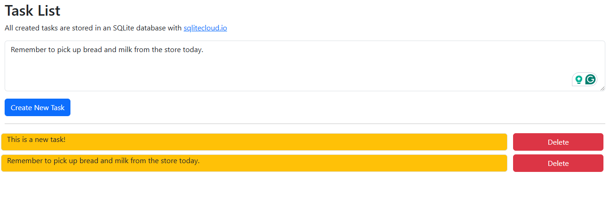
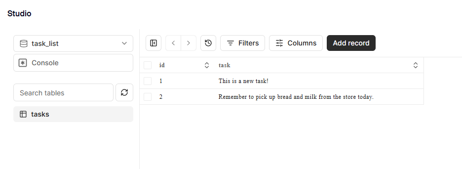

# flask-sqlitecloud-example
This project is an example Flask app that uses [sqlitecloud.io](https://sqlitecloud.io/), a distributed relational database system built on top of the SQLite database engine. This project was created to learn more about that platform and provide an additional example of using their Python client SDK with Flask and SQLAlchemy. This project also implements [Bootstrap](https://getbootstrap.com/) and [HTMX](https://htmx.org/) for a simple and clean UI/UX.

The app is a simple task list. Tasks can be written and submitted by the user to update their list of todos. Tasks can also be deleted from the list as needed.



These actions are reflected in the SQLite database and can be viewed from the SQLite Cloud online studio.



---

## Setup and Execution Instructions

Follow these steps to set up and run this example on your local machine. This guide assumes you have Git and Python (3.10 or above) installed on your system.

### 1. Create a Free account with SQLite Cloud

At the time of writing this, [sqlitecloud.io](https://sqlitecloud.io/) has a free tier where users can have an account with 1GB of free storage space on the platform. Create your account and step through the process of creating a project, node, and a database. This guide does not include those steps in-depth, but it should be pretty straightforward with its easy-to-use UI. After doing this, SQLite Cloud should be able to generate an API connection string for your created database like the example below:

```commandline
sqlitecloud://MyNode.sqlite.cloud:8860/task_list?apikey=ThisIsAFakeAPIKeyForDemonstrationPurposes
```

### 2. Clone the Repository

Next, clone this repository from GitHub to your local machine:

```bash
git clone https://github.com/forgineer/flask-sqlitecloud-example.git
```

### 3. Navigate to the Project Directory

From the terminal navigate to the newly cloned project `flask-sqlitecloud-example` directory:

```bash
cd flask-sqlitecloud-example
```

### 4. Create and Activate a Python Virtual Environment

Create a virtual environment in the project directory. This isolates the project dependencies from your global Python environment and is considered good practice.

To create a virtual environment, run:

```bash
python -m venv venv
```

Activate the virtual environment:

- On Windows, use:

  ```bash
  .\venv\Scripts\activate
  ```

- On Unix or MacOS, use:

  ```bash
  source venv/bin/activate
  ```

### 5. Install the Application Dependencies

With the virtual environment activated, install its core dependencies using pip:

```bash
pip install flask flask-sqlalchemy requests sqlalchemy sqlalchemy-sqlitecloud sqlitecloud
```

Using the latest Python and package versions is expected to work. However, if conflicts do arise, this example was originally written using Python 3.10 and should be repeatable with the list of original package versions listed in the `dev_requirements.txt` file if needed.

```bash
pip install -r dev_requirements.txt
```

### 6. Create a Config File Module

Create a configuration file containing the connection string from step one above. This should be written as a Python module `config.py` with a variable named `SQLALCHEMY_DATABASE_URI` set to the value of the connection string. When the application runs, it will read this configuration automatically and enable connectivity between the app and your SQLite Cloud database.

```python
# config.py
SQLALCHEMY_DATABASE_URI='sqlitecloud://MyNode.sqlite.cloud:8860/task_list?apikey=ThisIsAFakeAPIKeyForDemonstrationPurposes'
```

> :warning: If you decide to fork, copy, and/or build onto this example for your purposes, please ensure that you <u>exclude</u> this file from your repository from within your `.gitignore` file.

### 7. Run the Application

Start the application with Flask’s development server. Since the application is mostly self-contained within the `app.py` module, the default run command can be used:

```bash
flask run
```

### 8. Access the Application

Once the application is running, open your web browser and navigate to:

```
http://localhost:5000
```

I hope this example is/was helpful to you!